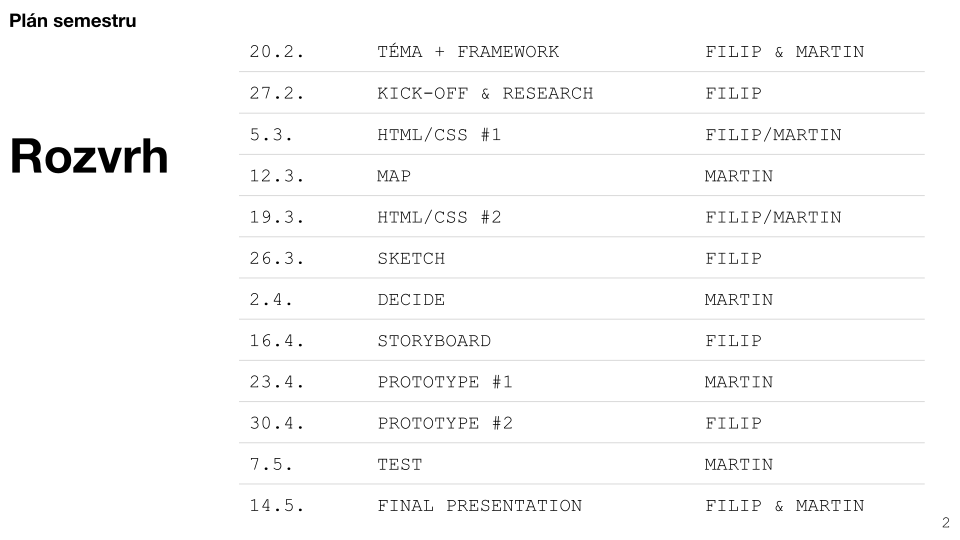

# Web design a uživatelská rozhraní

Výuka předmětu [4ME280 Web design a uživatelská rozhraní](https://insis.vse.cz/katalog/syllabus.pl?predmet=156489) probíhá blokově vždy ve čtvrtek od 12.45 do 17.45 v zimním nebo letním semestru 
v rámci programu [Multimedia v ekonomické praxi](https://kme.vse.cz/studium/bakalarske-studium/obor-multimedia-v-ekonomicke-praxi/).
Vyučujícími jsou [Filip Dědic](https://www.linkedin.com/in/filipdedic/), 
~~[Aleš Brom](https://www.linkedin.com/in/ales-brom-8077527/), [Jakub Goldmann](https://www.linkedin.com/in/jakubgoldmann)~~ 
a [Martin Kopta](https://www.linkedin.com/in/kopta).

Teoretická příprava v předmětu probíhá formou domácího samostudia z poskytnutých 
veřejných zdrojů (videopřednášky, články, kapitoly z knih). Během hodin ve škole 
pak studenti pracují v týmech na svých projektech.

Tématem letního semestru 2020 je web nebo aplikace městské komunity.

~~Předmět sleduje designový proces 
[Double Diamond](https://www.designcouncil.org.uk/news-opinion/design-process-what-double-diamond) 
britské organizace *Design Council* [s úpravami](https://www.dannessler.com/intro-process) 
od švýcarského návrháře *Dana Nesslera*. Double Diamond srovnáváme s dalšími procesy jako 
jsou [Human-Centerd Design by Ideo](https://www.ideo.com/post/design-kit) 
nebo [Stanford dSchool Design Thinking](https://dschool.stanford.edu/resources-collections/a-virtual-crash-course-in-design-thinking).~~

Počínaje letním semestrem 2020 osnovy předmětu vycházejí z rámce [Design Sprint 2.0](https://www.sessionlab.com/templates/design-sprint-2-0/), který vytvořil autor knihy Sprint [Jake Knapp](https://jakeknapp.com/) a berlínská agentura [AJ&Smart](https://ajsmart.com).

Výuka je organizována přes [Slack](https://4me280.slack.com/). Po dobu uzavření školního campusu probíhá výuka vzdáleně prostřednictvím [Microsoft Teams](https://teams.microsoft.com/l/team/19%3a89f64dc12bc24fe2adf6b83581821f60%40thread.tacv2/conversations?groupId=78c061a6-83f7-4a31-aacf-cca8d4460cac&tenantId=2b51a4b3-443f-4406-8ca4-19056a79a444). Výsledkem semetrální práce je prezentace tvorby otestovaného prototypu v HTML na [Glitch.com](https://glitch.com/@garcon/4-me-280-20-ls) podle klientského zadání.

Najdete nás také na [Twitteru](https://twitter.com/4me280) nebo [Instagramu](https://instagram.com/4me280).
